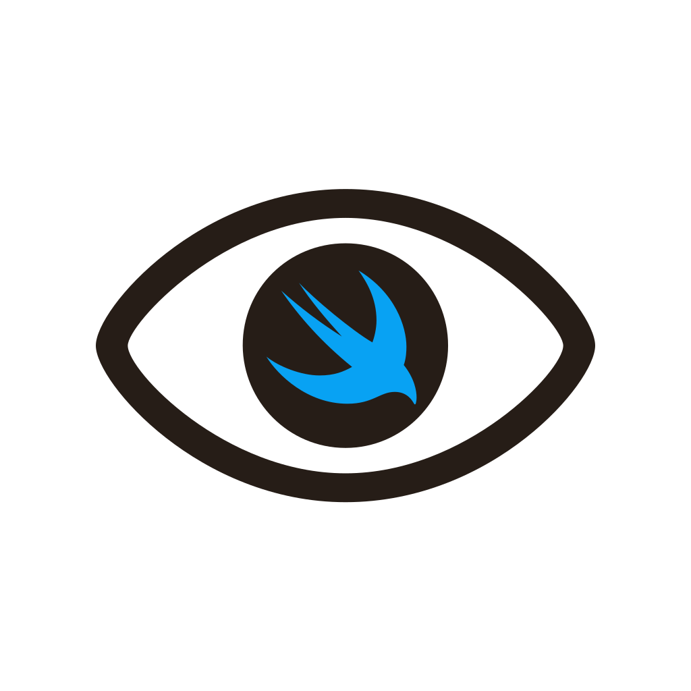
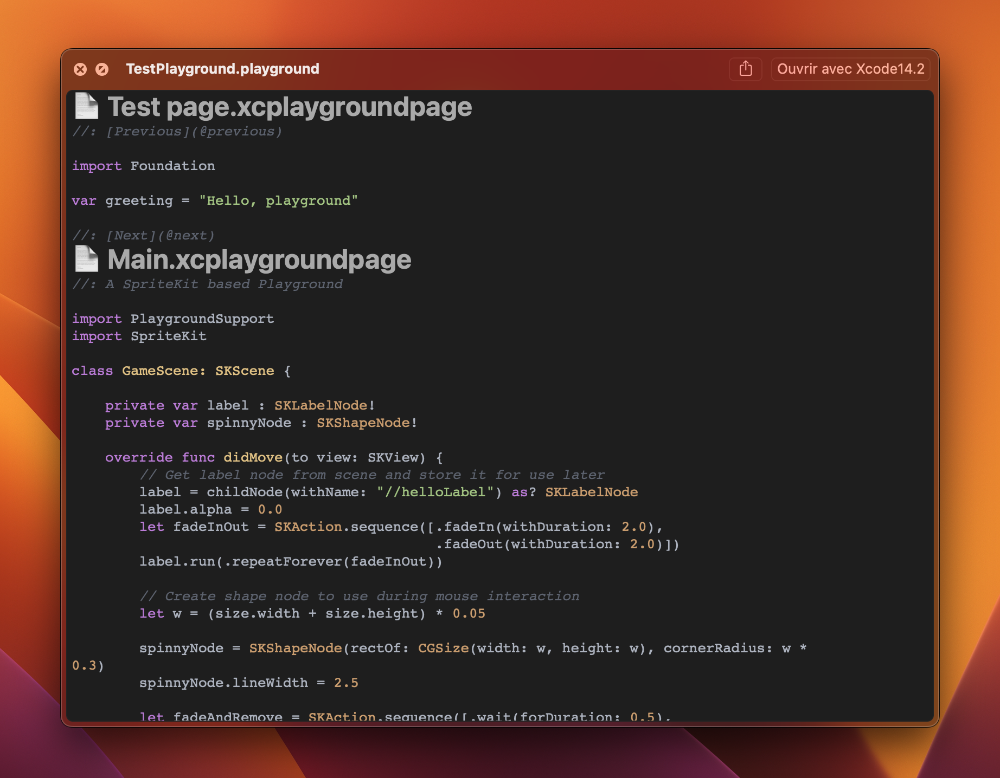

  

  <h3 align="center">PlaygroundQLPreviewProvider</h3>

  

    A macOS application that enable Quick Look previews on your Playground files
  

## About The Project

Playgrounds are a great way to prototype Swift code, and tools like [PlayAlways](https://github.com/insidegui/PlayAlways) make them easy to create.
Having a lot of of playgrounds makes it hard to find something because it needs to be opened.

This app enable QuickLook previews to playground files, making it easy to see what is in them.

### Installation

1. Download the [latest release](https://github.com/alexandre-pod/PlaygroundQLPreviewProvider/releases/latest) from the GitHub releases.
2. Open the app once, then close it.
3. You can now preview playground files.

### Credits

* [Highlightr](https://github.com/raspu/Highlightr) handles syntax highlightning in the previews.
